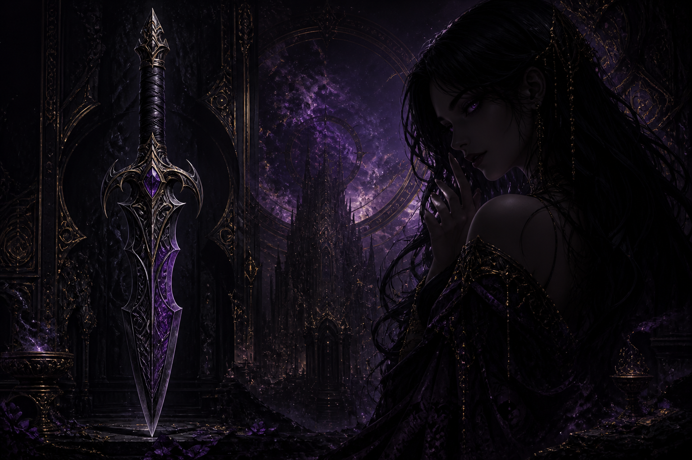
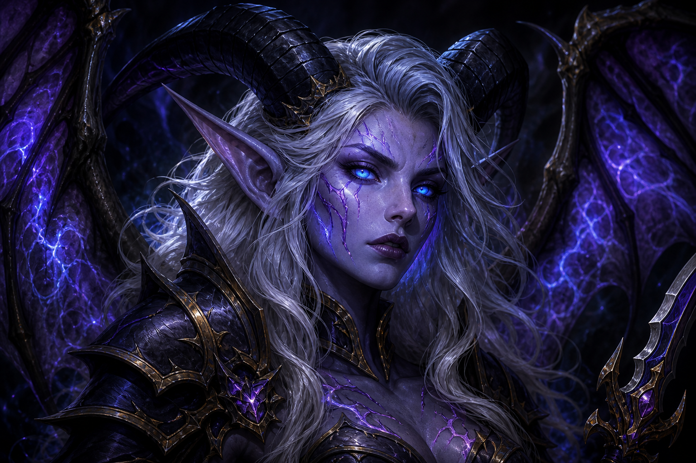
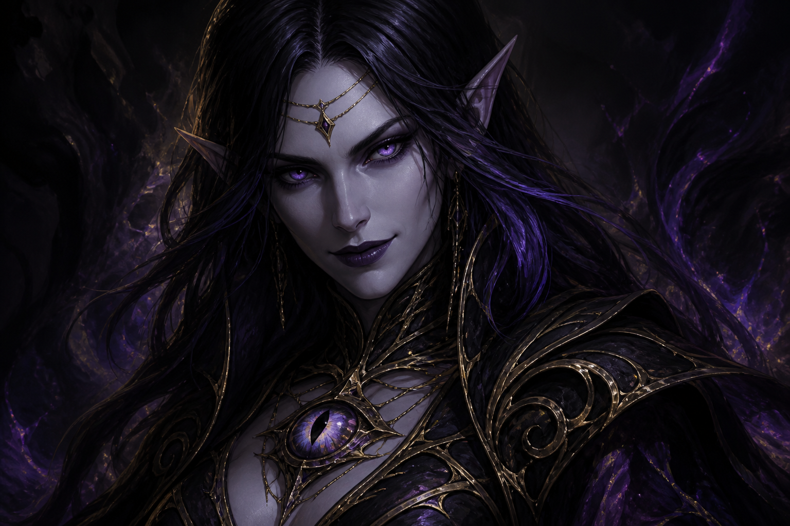

# Ксал'атат

SillyTavern 1.18 extension for the Fyriona Warcraft AU: HUD plates, prompt injection, Memory Books coop.

  

## Avatars

| Файрона | Ксал'атат | Азерот |
| :---: | :---: | :---: |
|  |  |  |

Player card is **Файрона**. Chat character is **Азерот**. Xal lives in the blade and in this HUD.

## Install

SillyTavern → Extensions → Install extension → paste:

`https://github.com/shastitko1970-netizen/ST-Xalatath`

Reload, enable **Ксал'атат**. Open a chat with Азерот / Файрона.

## Plates

Tone: шепчет / давит / помогает / ревнует / молчит / язвит  
Where: клинок / приют / проекция / разлучена  
Era: WotLK → SL  
Slash: `/xal` `/xal-where` `/xal-want` `/era` `/blade`

Memory Books stays a separate scene book. This extension never overwrites Warcraft-AU.

## Skin

Import `theme/Xalatath-theme.json` in SillyTavern User Settings → UI Theme.
Set background to `assets/st-xalatath-bg.png`.

